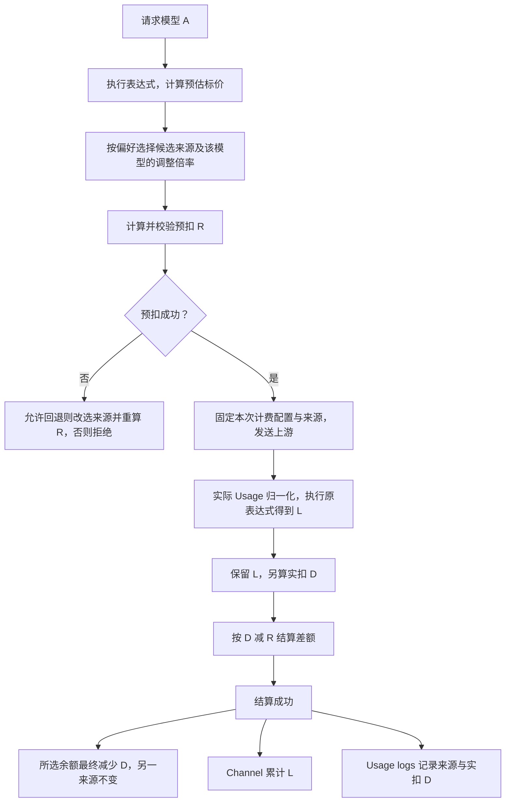

# 需求表

- 二档额度结构：订阅额度、充值额度；充值额度可通过兑换码获得。
- 订阅额度和充值额度的扣费倍率按模型分别配置。配置粒度为「模型 × 资金来源」，同一模型的两种倍率相互独立，不是所有订阅或所有充值共用一个固定折扣。
- 倍率既支持减免，也支持加价。下文统一称为「扣费调整倍率」：`0.5x` 表示减免 50%，`1x` 表示不调整，`1.5x` 表示加价 50%。不把「减免 10%」误写为 `0.1x`，其实际扣费倍率为 `0.9x`。

## 使用例 A：表达式标价与按模型、按资金来源调整扣费

> 本文描述期望行为，不表示当前程序已经实现。第 1—4 节整理已明确的使用例；第 5—6 节是补充建议，第 7 节列出仍需决定的问题。建议和待确认项不视为已确认规则。

### 1. 前提与金额含义

一名用户同时拥有订阅额度和充值额度。请求开始前，订阅本周期的**可用余额**为 N dollar，充值可用余额为 M dollar。

- N 是订阅周期总额度减去本周期已用额度后的余额，不是周期总额度本身；M 是当前充值余额。
- 本例只考虑文本 token 的表达式计费，分组倍率为 1，无其他请求倍率、工具附加费或违规费。多种折扣的组合不在本例中隐含决定。
- 本例的余额足以完成预扣和结算；没有并发消费、周期重置或中途修改配置。两种支付情形分别从相同的 N、M 开始，不是同一请求扣两遍。
- `L` 为根据实际 usage 执行模型表达式得到的标价金额；`r(model, source)` 为该模型在指定资金来源下的扣费调整倍率；`D = L × r(model, source)` 为成功结算时的实扣金额。整数 quota 的舍入建议见第 5 节。
- 减免不扩大显示余额，也不改变原始 token 用量。例如订阅倍率为 `0.5x` 时仍显示 N，而不是 2N；不同模型倍率不同，不提供一个适用于所有模型的「折算后余额」。
- Channel 记录 L，Usage logs 主金额及选中资金来源的扣款记录 D。Channel 的 L 是配置标价对应的计量金额，不等同于上游供应商账单中的真实采购成本。

按模型配置的示意如下。B、C 的订阅倍率用于说明可配置能力，不代表平台的默认值；其充值倍率未在本例中指定。

| 模型 | 订阅扣费调整倍率 | 充值扣费调整倍率 |
| --- | --- | --- |
| A | `0.5x`，减免 50% | `0.9x`，减免 10% |
| B | 可配置为 `1x`，不调整 | 独立配置，不继承订阅倍率 |
| C | 可配置为 `1.5x`，加价 50% | 独立配置，不继承订阅倍率 |

充值侧同样允许减免、不调整和加价。A 的设置不能影响 B、C，同一模型订阅侧的改动也不能自动改动充值侧。若 C 的订阅倍率为 `1.5x`，且其自身表达式标价为 `L_C`，则订阅扣 `1.5 × L_C`，Channel 仍记 `L_C`；不能把倍率强制截到 1。

### 2. 模型 A 的表达式标价

本例默认按 `k = 1000`，即阈值 `T = 256,000 tokens`。`256k` 仅为示例，实际阈值由管理员在后台按模型供应商的规则配置为精确 token 数；若供应商采用 `k = 1024`，管理员自行换算后填写 `256 × 1024 = 262,144 tokens`。

输入定价如下，单位均为 dollar / 1M tokens。这里的计价单位 `1M tokens` 按现有表达式计费口径固定为 `1,000,000 tokens`，不随上下文阈值的 k 取值改变：

| 输入上下文总长度 | 普通输入 | 缓存读取输入 |
| --- | --- | --- |
| 小于 T | 2 | 0.5 |
| 大于等于 T | 未超过阈值的部分为 2；仅超过部分为 4 | 0.5 |

长上下文不是「达到阈值后全部普通输入都按 4 收费」。普通输入与缓存如何分配阈值区间仍待确定，因此此处不编造完整的输入分段表达式。

**输出按生成区间单独处理，不再仅根据输入长度给全部输出统一选价。**按输入后连续追加输出的 token 位置计算，前 T 个 token 属于阈值内，第 T+1 个及之后属于阈值后。输出可能全部在阈值内、横跨阈值，或全部在阈值后。

若结算时能够可靠确定两段各有多少输出 tokens，则采用真正的线性分段计价：阈值内输出按 6，阈值后输出按 12，各 token 只计价一次。对于**单路、连续追加、上下文不截断且计数口径一致**的文本生成，可信的实际输入总长度 I 和输出总数 O 已足够算出分段数量，无需上游逐 token 或逐 chunk 报告跨界位置：

```text
I = 实际输入上下文总长度（包含缓存）
O = 实际输出 token 总数
阈值内输出 O_before = min(O, max(T - I, 0))
阈值后输出 O_after  = O - O_before
输出标价 = (O_before × 6 + O_after × 12) / 1,000,000
```

以上是数学公式，T 不是现有表达式的内置变量；实际表达式使用管理员配置的精确阈值，本例为 `256000`。对于本例纯文本的计数口径，I 对应 `len`，O 对应 `c`。

| 输出位置 | 条件（O > 0） | 输出计价 |
| --- | --- | --- |
| 全部在阈值内，包括恰好结束在边界 | `I + O <= T` | 全部按 6 |
| 横跨边界，能够准确拆分 | `I < T` 且 `I + O > T` | 前段按 6，后段按 12 |
| 全部在阈值后，包括输入已经占满前 T 个 tokens | `I >= T` | 全部按 12 |

例如 `I = T - 1000`、`O = 3000` 时，前 1000 个输出按 6、后 2000 个按 12，**仅输出部分的标价**为 $0.030。若 `I = T`、`O = 3000`，则输出全在阈值后，输出标价为 $0.036。没有输出时输出费用为零。

**无法精确拆分时的兜底：**已知输出不是全部位于阈值后，但触及或横跨边界，且无法可靠确定跨界数量时，整段 Output 都采用阈值前的 6，不因为触及边界就对全部输出收 12。例如只知道上述 3000 个输出横跨边界而不知道各段数量时，输出标价按 $0.018 计。能够确认全部输出位于阈值后的情形仍全部按 12。

缺失 usage、本地估算、多个独立生成分支的合计输出，不能未经核验就当成一条连续序列的精确位置证据。多路输出若要精确分段，应有各路计数；连输出总数或是否全在阈值后都无法确定时，属于第 7 节的异常计量政策，不能把缺失字段当成真实零值。

现有表达式具备 `len`、`c`、`min`、`max`，可以表达上述精确分段算术；但单凭这几个数值不能证明 usage 可靠，也不表示已实现按证据自动选择精确分段或兜底的链路。

本次实际用量是：

- Cached Input：100,000 tokens。
- Input：5,000 tokens，指不含上述缓存的普通输入。
- Output：1,000 tokens。
- 输入上下文总长度为 105,000 tokens，不包含输出，未达到 256k。

归一化后的表达式变量为 `p = 5000`、`cr = 100000`、`c = 1000`、`len = 105000`。若上游的总输入已经包含缓存，不能再把缓存重复加入总输入。输入区间用 `len` 判断；输出分段同时使用 `len` 与 `c`，不能把排除缓存后的 `p` 当作上下文总长度。本次输出结束时累计为 106,000 tokens，全部输出仍在阈值内。

本例输入和全部输出都在阈值内，对此情形可表示为以下表达式；它不是模型 A 的完整分段表达式：

```text
tier("standard", p * 2 + cr * 0.5 + c * 6)
```

```text
缓存输入标价 = 100,000 × 0.5 / 1,000,000 = $0.050
普通输入标价 =   5,000 × 2   / 1,000,000 = $0.010
输出标价     =   1,000 × 6   / 1,000,000 = $0.006
总标价 L     = $0.066
```

原例中的 p dollar 和 q dollar 均为 $0.066。两个支付情形使用相同模型、表达式、用量与请求条件，标价不会因为资金来源改变。

### 3. 两种支付情形

#### A-1：本次选中订阅额度

模型 A 的订阅扣费调整倍率为 `0.5x`：

- 本次标价：`L = $0.066`。
- 本次实扣：`D = $0.066 × 0.5 = $0.033`。
- 订阅本周期已用额度增加 $0.033，剩余为 `N − $0.033`；周期总额度不变。
- 充值余额仍为 M，不扣充值额度。
- Channel 累计使用金额增加 $0.066。
- Usage logs 显示使用订阅，主金额为 $0.033。

#### A-2：本次选中充值额度

模型 A 的充值扣费调整倍率为 `0.9x`：

- 本次标价：`L = $0.066`。
- 本次实扣：`D = $0.066 × 0.9 = $0.0594`。
- 充值余额变为 `M − $0.0594`。
- 订阅本周期已用额度及剩余 N 不变。
- Channel 累计使用金额增加 $0.066。
- Usage logs 显示使用充值额度，主金额为 $0.0594。

两种情形是支付来源的对照。本例不规定如何选中来源，也不表示系统自动选更便宜的来源；顺序、余额不足回退与跨来源拆分见第 7 节。若确实先后完成两次请求，Channel 合计增加 $0.132，订阅和充值分别按各自那次请求扣款。

### 4. 已明确的余额与显示口径

| 位置 | 本例要求 |
| --- | --- |
| 订阅周期已用、剩余 | 使用订阅时按 D 增加已用、减少剩余；使用充值时不变 |
| 充值剩余 | 使用充值时减少 D；使用订阅时不变 |
| 单条 Usage log | 显示本次资金来源与成功结算的实扣 D |
| Channel 累计使用 | 增加标价 L，不受订阅或充值侧的减免、加价影响 |
| 原始 token 用量 | 仍是实际的输入、缓存、输出数量，不乘扣费调整倍率 |

Channel 的「上游剩余余额」与本地「累计使用金额」不同：前者来自上游余额查询，不能因为本地累计 L 就直接将其减去 L。

### 5. 预扣、结算、退款与舍入（补充建议）

以下建议用于补齐本例的完整生命周期，需与第 7 节的未决政策一并确认。

1. 先用模型表达式计算预估标价，再按候选资金来源的 `r(model, source)` 得到折后或加价后的预扣金额 R。资金来源倍率不改写模型的标价表达式。
2. 预扣应校验所选来源余额，以及适用的 API Key 预算。API Key 预算不是第三个资金钱包，同步减少预算不代表向用户重复收费。
3. 若允许在预扣不足时回退，改选来源后必须换用该模型在新来源下的倍率，重新计算 R；不能把订阅侧金额原样拿去扣充值额度。
4. 成功预扣后固定本次资金来源、表达式和调整倍率。配置修改只影响后续请求；本次结算和退款不重新读取当前倍率。
5. 上游完成后，用实际 usage 重新执行原表达式得到 L，再计算 D。对原资金来源只结算差额 `D − R`：正数补扣、负数退差额，而不是在 R 之外再扣完整 D。
6. 在没有其他余额变动时，结算成功后所选来源相对请求前最终只减少 D。退款按原来源和实际预扣记录恢复，不按新倍率重新计算；失败、断流以及补扣失败的具体收费政策见第 7 节。
7. 标价和实扣从未舍入金额分别转换为整数 quota，不从已经打折或舍入的整数金额反推标价，不逐项提前舍入。沿用表达式计费的 quota 换算与舍入规则。

以 `Q = QuotaPerUnit`、`Round` 表示现有表达式的整数 quota 舍入，建议的对账公式为：

```text
渠道计量 quota = Round(L × Q)
最终实扣 quota = Round(L × r(model, source) × Q)
结算差额 quota = 最终实扣 quota − 实际预扣 quota
```

当前默认 `Q = 500000`。本例标价为 33000 quota，订阅实扣为 16500 quota，充值实扣为 29700 quota，均没有舍入差异。界面货币精度不反向改变内部扣款。

**预扣演算，不是最终价格：**假设本地估为 105,000 普通输入 tokens，预扣乘数为 1，尚未知缓存命中和输出，且未走免预扣，则预估标价为 $0.21。按上述建议：

| 来源 | 预扣 R | 最终实扣 D | 结算退差额 R − D |
| --- | --- | --- | --- |
| 订阅 `0.5x` | $0.105 | $0.033 | $0.072 |
| 充值 `0.9x` | $0.189 | $0.0594 | $0.1296 |

因此请求进行中的可用余额可能暂时低于最终余额；够付最终费用不一定够预扣。不能把预扣 R 当作最终 Usage log 实扣金额。

正常成功路径示意如下；这是建议链路，不规定结算异常时的记账结果：



### 6. 其他展示与对账（补充建议）

- 用户累计消费、API Key 已用／剩余预算、用户消费统计及导出建议按 D 计算；不额外放大或缩小 API Key 的额度上限。用户累计消费包含订阅和充值消费，不能用充值余额的减少量推导全部消费。
- Usage log 明细建议保留实际生效的计费模型、来源、表达式／可追溯版本、调整倍率 r、标价 L、实扣 D，以及结算状态。价格页展示标价，并分别标明该模型的订阅与充值调整倍率；不能只显示表达式原价，却让用户无法解释日志中的实扣差异。
- 以 Usage logs 为数据源的合计，即使按 Channel 筛选，仍建议叫「用户实扣合计」并累计 D；Channel 的标价计量合计累计 L。仪表盘、渠道报表和导出必须标明金额口径，不把两者都含糊称为「渠道消费」。
- 如果日志展示剩余额度，应明确这是扣款时的历史快照还是查询时的当前余额；存在其他并发消费时，历史快照不等于当前余额。本例的 `N − D`、`M − D` 只针对没有其他变动的情况。

### 7. 仍需决定的问题

1. **普通输入与缓存的阈值分配及计量证据。**输入超过阈值时，普通输入与缓存如何分配阈值内外部分？阈值由管理员按供应商配置，输出的精确分段及无法拆分时的低价兜底规则已在第 2 节明确；仍需核验各上游的实际输入、输出计数是否完整、同口径，能否用于连续位置计算。不能把存在 `len`、`c` 数值等同于已证明具备精确分段能力。
2. **模型匹配规则。**调整倍率以对外模型名、计费别名还是渠道映射后的上游模型名查找？建议与表达式选价使用同一计费模型标识，并明确精确匹配／别名规则，避免因路由或别名意外获得另一价格。
3. **缺省倍率及允许范围。**未配置的「模型 × 来源」是否默认 `1x`？是否允许 `0x` 完全免单、倍率上限是多少？已明确必须支持大于 1 的加价，负数及 NaN、Infinity 不能成为有效扣款倍率；不能把配置缺失、非法值和显式免单混为一谈。
4. **资金来源选择。**是否保留现有用户计费偏好及订阅允许钱包回退的规则？一笔请求是否始终单一来源？建议保留单一来源，并仅在预扣阶段按允许的偏好回退，不隐含「自动选最低价」或「先耗尽订阅再扣充值」。多份有效订阅如何选择也应沿用或明确现有规则。
5. **异常结算。**实际费用高于预扣而余额不足、数据库扣款失败、表达式求值失败、上游 usage 缺失、断流或取消时如何处理？应区分应扣金额、已成功扣款和已退金额，不能把未成功补扣的全额记成实扣。上游已有有效用量时是否收费，不能仅凭客户端失败就认定全额退款；用户扣款失败时 Channel 如何记账也需明确。
6. **配置与订阅周期变动。**是否接受请求级配置快照？跨重置周期、订阅到期以及并发消费时，预扣、补扣和退款如何归属，不能把上一周期的退款当成新周期额外赠额。
7. **其他金额口径与适用范围。**是否接受第 6 节的用户累计／API Key／统计展示建议？存在分组倍率时，Channel 的 L 是否包含它、调整倍率在哪一步应用？工具附加费、违规费、图片、音频及异步任务不由本次文本例子自动决定。
